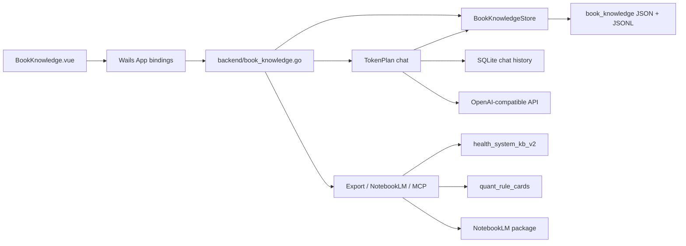

# 得到课程下载桌面端

> wails + go + vue 构建的《得到》APP 课程下载桌面客户端

技术栈如下：

> 1. [wails快速入门](https://wails.io/zh-Hans/)
> 2. [Vue3.x](https://cn.vuejs.org/guide/introduction.html)
> 3. [Vue Router 4.x](https://router.vuejs.org/zh/introduction.html)
> 4. [vue3 element-plus](https://element-plus.gitee.io/zh-CN/)
> 5. [typeScript](https://www.typescriptlang.org/zh/docs/)
> 6. [Vite](https://cn.vitejs.dev/)
> 7. [pinia](https://pinia.vuejs.org/zh/)


[](https://goreportcard.com/report/github.com/yann0917/dedao-gui)

## 特别声明

仅供个人学习使用，请尊重版权，内容版权均为得到所有，请勿传播内容！！！

仅供个人学习使用，请尊重版权，内容版权均为得到所有，请勿传播内容！！！

仅供个人学习使用，请尊重版权，内容版权均为得到所有，请勿传播内容！！！

## 特性

* 展示首页内容
* 可扫码登录
* 可查看**购买**的课程，课程详情，课程文章列表，可播放课程音频
* 可查看听书书架列表，听书文稿，可播放每天听本书音频
* 可查看电子书架列表，电子书详情，书评，可加入书架
* 可查看已购买的锦囊
* 可查看知识城邦
* 课程可生成PDF，文稿生成 Markdown 文档，也可生成 mp3 文件
* 每天听本书可下载音频，文稿生成 pdf、 Markdown 文档
* 电子书可下载 pdf，html, epub 等格式

## 本 fork 更新点

> 以下能力主要面向个人书籍知识库、NotebookLM Bridge、本地 MCP 和跨项目知识复用。

### 2026-06-27

* 新增「书籍知识库」工作台：自动从已下载电子书 HTML 提取章节、chunks、claims、citations，并以本地 `book_knowledge` 目录保存。
* 新增电子书「下载并入 Wiki」入口：下载电子书 HTML 后可触发 `llms-wikis ingest-ebook` 与 `pipeline/compiler.py --changed-only`，将书籍重新抽取到 wiki 知识库。
* 新增书籍对话能力：接入阿里云 TokenPlan OpenAI-compatible API，默认模型为 `qwen3.7-max`，支持总结本书、分析本书、行动清单、规则卡和自由问答。
* 新增对话历史：每次书籍分析完成后写入本地 SQLite，可在书籍知识库中查看、恢复历史记录。
* 新增 Markdown 渲染视图：对话答案支持「渲染 / Markdown」切换，优化标题、列表、表格、引用块和代码块显示。
* 新增多书并行分析：按 `book_id` 管理分析 loading 状态，切换到其他书时可以继续发送新请求。
* 新增 NotebookLM Bridge：可导出 `book.md`、`claims.md`、`notebooklm-prompt.md` 资料包，一键打开 NotebookLM，并保存每本书对应的 NotebookLM 链接。
* 新增 MCP 能力：提供 `cmd/book-mcp` stdio server，可向其他大模型暴露书籍列表、检索、章节读取、导出等工具。
* 新增在线 kbase HTTP 服务：提供 `cmd/kbase-server`，可部署到 `kbase.executor.life`，用 Bearer token 向 health/proofroom 暴露书籍检索和 System KB export。
* 新增项目导出：支持导出为 `health_system_kb_v2` 健康知识库格式，以及 `quant_rule_cards` 量化规则卡草案。
* 优化登录二维码流程：在缺失或失效 CSRF token 时自动刷新首页状态并重试，降低扫码二维码加载失败概率。
* 优化书籍知识库 UI：新增专业化工作台布局、搜索、章节/claims/chunks/MCP/NotebookLM tabs 和历史记录侧栏。

### 架构概览

本 fork 在原有 Wails 桌面端上新增了一条本地书籍知识库链路。`frontend/src/views/BookKnowledge.vue` 是工作台入口，只负责书籍选择、搜索、对话、历史恢复、NotebookLM 操作和导出按钮；所有数据读写都通过 Wails 生成的 `frontend/wailsjs/go/backend/App.*` 调用后端。

后端边界集中在 `backend/book_knowledge.go`，它把前端可调用方法转发到 `backend/app` 中的领域模块：



核心数据模型定义在 `backend/app/book_knowledge.go`：一本书由 `BookKnowledgeBook`、`Chapter`、`Chunk`、`Claim`、`Citation` 组成，并保存到本地 `book_knowledge` 根目录。默认根目录可通过 `DEDAO_BOOK_KNOWLEDGE_ROOT` 覆盖；每本书有独立目录，结构包括 `manifest.json`、`chapters.jsonl`、`chunks.jsonl`、`claims.jsonl`、`citations.jsonl`。对话层位于 `backend/app/book_chat.go`，从本地知识包构造上下文，调用 TokenPlan OpenAI-compatible API，并把成功回答写入 `book_chat_history.sqlite3`。外部集成包括 `cmd/book-mcp` 的 stdio MCP 工具、`cmd/kbase-server` 的 Bearer token 私有 HTTP 检索服务，以及 NotebookLM Bridge 导出的 markdown 资料包和 notebook 链接。

### kbase HTTP 服务

本服务面向个人私有部署，API 路由必须配置 `KBASE_AUTH_TOKEN`。未配置 token 时，`/health` 仍可探活，但 `/api/*` 会拒绝访问。浏览器页面由 Nginx Basic Auth 保护；登录后 Web UI 会通过 `/browser/session-token` 自动换取同源 Bearer token 并写入浏览器本地存储。自动化客户端仍应直接使用 `Authorization: Bearer <KBASE_AUTH_TOKEN>` 调用 `/api/*`。

```bash
cd /opt/dedao-gui
KBASE_AUTH_TOKEN="replace-with-long-secret" \
KBASE_BOOK_KNOWLEDGE_ROOT="/opt/dedao-kbase/book_knowledge" \
KBASE_SYSTEM_KB_EXPORT_PATH="/opt/dedao-kbase/artifacts/system_kb_export.json" \
go run ./cmd/kbase-server --addr 127.0.0.1:8719
```

对外域名建议由 Nginx/Caddy/Cloudflare Tunnel 终止 TLS 后反代到本地端口：

- `GET /health`：无需 token，用于服务探活。
- `GET /api/books`：列出书籍知识包。
- `GET /api/search?q=关键词&limit=5`：检索书籍 chunks/claims。
- `GET /api/system-kb/manifest`：返回 System KB export 摘要。
- `GET /api/system-kb/export`：返回 health/proofroom 导入用的 `system_kb_export.json`。

### 微信/WC Plus 来源工作台

在线 Web UI 新增 `/wechat-source` 和 `/wcplus-source`。所有浏览器请求都走 kbase 的 Bearer 代理；浏览器不会直接访问本机 WC Plus 端口。

```bash
KBASE_AUTH_TOKEN="replace-with-long-secret" \
KBASE_BOOK_KNOWLEDGE_ROOT="/opt/dedao-kbase/book_knowledge" \
WCPLUS_BASE_URL="http://127.0.0.1:5001" \
go run ./cmd/kbase-server --addr 127.0.0.1:8719
```

`WCPLUS_BASE_URL` 必须指向 kbase 服务端可访问的 WC Plus API。若 kbase 部署在线上服务器，而 WC Plus 只运行在个人 Mac 上，线上服务器无法访问个人 Mac 的 `127.0.0.1:5001`；此时需要把 WC Plus API 放到服务器可达的地址、在同一台机器上运行 kbase 与 WC Plus，或在 `/wcplus-source` 使用“手动导入知识库”粘贴 WC Plus 导出的正文。

`/wcplus-source` 的“环境检查”会显示 kbase 服务端实际访问的 WC Plus 地址，并可一键复制诊断信息。WC Plus API 暂时不可达时，可在“手动导入知识库”粘贴正文，或选择 `.txt` / `.md` 文件填入正文后再导入。

常用代理接口：

- `GET /api/wcplus/env/check`：检查 WC Plus 服务和公众号列表 API。
- `GET /api/wcplus/gzh/list`、`GET /api/wcplus/gzh/articles`、`GET /api/wcplus/article/content`：加载公众号、文章和正文。
- `POST /api/wcplus/import/article`、`POST /api/wcplus/import/account`：导入单篇或一批文章到书籍知识库。
- `POST /api/wcplus/import/raw`：将粘贴的标题、公众号、原文链接和 Markdown/纯文本正文直接导入书籍知识库，不依赖 WC Plus API 联通性。
- `POST /api/wcplus/task/new`、`POST /api/wcplus/task/control`、`GET /api/wcplus/task/all`：创建、启动和查看下载任务。
- `GET /api/wcplus/search`、`GET /api/wcplus/article/search-title`、`GET /api/wcplus/search-gzh`：全文、标题和公众号候选检索。
- `GET /api/wcplus/export/text`、`GET /api/wcplus/export/gzh-csv`、`POST /api/wcplus/export/all-articles-xlsx`：触发 TXT/CSV/XLSX 导出。

### NotebookLM Bridge 使用方式

1. 在「电子书架」中下载并入 Wiki，或先下载电子书 HTML 后进入「书籍知识库」。
2. 在「书籍知识库」选择目标书籍，打开 `NotebookLM` tab。
3. 点击「导出资料包」，生成 `book.md`、`claims.md`、`notebooklm-prompt.md` 和 `upload-guide.md`。
4. 点击「打开 NotebookLM」，在 NotebookLM 中创建 notebook 并上传 `book.md`、`claims.md`。
5. 点击「复制上传指南」或打开 `upload-guide.md`，按步骤复制提示词到 NotebookLM。
6. 将 NotebookLM 页面链接保存回 dedao-gui，后续可从同一本书继续打开。

### 注：

1. 下载均在后台执行，下载完毕弹框会关闭，等待弹窗关闭或者点击确定下载后关闭，均会在后台执行下载程序。
2. 如果遇到 `496 NoCertificate` 消息提示，请登录网页版进行图形验证码验证。
3. 本应用上登录后再登录官方网页版会导致保存的 cookie 失效，使用 `rm -rf ~/.config/dedao/config.json` 删除配置信息后重新登陆本应用即可。

## 安装

构建请查看[wails 文档](https://wails.io/zh-Hans/docs/introduction)

1. `运行 go install github.com/wailsapp/wails/v2/cmd/wails@latest` 安装 Wails CLI。
2. clone 该项目，从项目目录，执行 `wails build`，即可构建二进制文件

### 安装依赖

wails 构建需要安装以下依赖：

* Go 1.21+
* NPM (Node 15+)

如果需要下载相应格式的内容，请按照下载需求，安装下列依赖：

#### pdf下载

* google chrome
  > 课程生成 PDF 需要借助 [Google-Chrome](https://www.google.cn/intl/zh-CN/chrome/)的渲染引擎
* wkhtmltopdf
  > 电子书转 PDF 需要借助[wkhtmltopdf](https://wkhtmltopdf.org/downloads.html)

#### 音频下载

* ffmpeg
  > 音频需要借助 [ffmpeg](https://ffmpeg.org/) 合成

### 功能截图如下：


## Stargazers over time

[](https://starchart.cc/yann0917/dedao-gui)

## License

[MIT](./LICENSE) © yann0917

---
