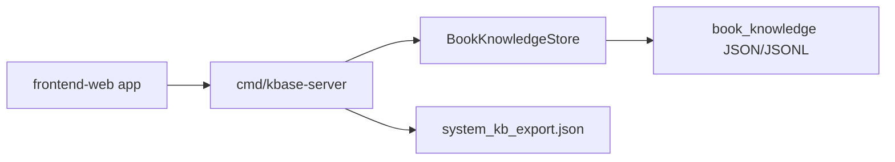

# Web KBase UI Design

## Goal

Build an independent browser UI for the private `kbase-server` so the local book knowledge base can be browsed and searched outside the Wails desktop app.

## Scope

The first version is read-only and matches the current HTTP API surface:

- Configure a kbase base URL and Bearer token in the browser.
- List books from `GET /api/books`.
- Open one book from `GET /api/books/{book_id}`.
- Search all books or the selected book with `GET /api/search`.
- Inspect System KB metadata from `GET /api/system-kb/manifest`.
- Download or inspect the export payload from `GET /api/system-kb/export`.

Out of scope for this version: TokenPlan chat, chat history, NotebookLM export, write operations, and public unauthenticated access.

## Architecture

Add a separate web app under `frontend-web/` instead of reusing `frontend/src/views/BookKnowledge.vue`. The existing desktop UI depends on Wails bindings and runtime helpers; the web UI should use plain HTTP so it can run in any browser.

`cmd/kbase-server` will serve the web build as static assets at `/` while keeping `/api/*` protected by the existing Bearer token middleware. `/health` remains unauthenticated.

## UI Structure

The page is a dense workbench, not a marketing page.

- Connection bar: base URL, token, connect status, refresh.
- Left rail: searchable book list with status and extractor.
- Center panel: query input, scope toggle, result list.
- Right panel: selected book details with tabs for overview, chapters, claims, chunks, and System KB.

The visual style should be quiet and utilitarian: compact spacing, clear active states, strong table readability, and restrained colors.

## Data Flow

The web app stores `baseUrl` and `token` in `localStorage`. A small API client attaches `Authorization: Bearer <token>` to every `/api/*` request. Error messages should surface HTTP status and response body when available; authentication failures must be visible, not silently swallowed.

## Testing

Use test-first smoke coverage for the new web app:

- Assert the page has connection, books, search, details, and System KB surfaces.
- Assert the API client sends the Bearer token.
- Assert unauthenticated or failed responses are surfaced as errors.

Verification should include the web build and relevant kbase Go tests.
