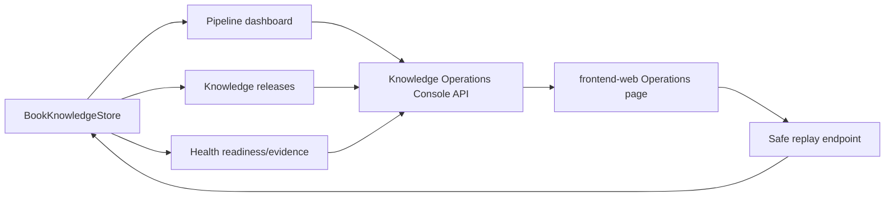

# Knowledge Operations Console Design

## Goal

Build a first-release operations console for the KBase knowledge supply chain.
The console makes release status, Health evidence review state, and safe failure
replay visible in one place without changing consumer ownership or exposing
authorized source bodies.

## Product scope

First release includes three product surfaces:

1. **Release Status Center** — shows each knowledge package's current pipeline
   stage, latest published release, quality state, downstream readiness, and
   safe next action.
2. **Health Evidence Review Workspace** — shows Health-eligible evidence drafts
   and review blockers as metadata, claim counts, citation counts, risk
   distribution, and gate reasons. Health keeps domain review and serving
   ownership.
3. **Failure Explanation / Safe Replay** — translates pipeline failure codes
   into operator-facing explanations and exposes only bounded replay actions:
   re-run analysis or re-run quality evaluation. Publishing and Health serving
   promotion are not replay actions.

Out of scope:

- automatic Health serving promotion;
- displaying downloaded source bodies;
- adding new source crawlers;
- changing medical or proof consumer review policy;
- bypassing G3/G4/G5/G6 gates;
- unsafe replay of publish, feedback, or external consumer writes.

## Architecture

Add a KBase operations aggregation layer beside existing release, pipeline, and
Health evidence APIs. The layer reads existing stores and returns a
privacy-safe console model. It does not own release creation, Health review, or
consumer publication.



The API returns enough information for operations decisions:

- package identity, title, source type/account, content hash, and current
  pipeline stage;
- latest published release identity and quality summary;
- Health readiness state and blocker reasons;
- evidence metadata: claim count, citation count, risk distribution, freshness,
  and usage policy;
- failure explanation: public error code, likely cause, safe next step, whether
  replay is available, and why dangerous replay is blocked.

## API design

### `GET /api/knowledge/operations`

Authenticated operator endpoint. Query:

- `limit`: optional, 1-500, default 100.

Response:

```json
{
  "schema_version": "knowledge_operations.v1",
  "summary": {
    "total": 3,
    "needs_analysis": 1,
    "needs_quality": 0,
    "ready_to_publish": 1,
    "published": 1,
    "blocked": 0,
    "health_ready_to_publish": 1,
    "health_published": 1,
    "health_blocked": 0
  },
  "items": [
    {
      "book_id": "source-...",
      "title": "Example",
      "pipeline_stage": "candidate",
      "next_action": "ready_to_publish",
      "release_id": "release-...",
      "quality_decision": "pass",
      "usage_policy": "evidence_only",
      "health": {
        "status": "ready_to_publish",
        "next_action": "publish",
        "serving_allowed": false,
        "reasons": ["consumer_review_required"],
        "claim_count": 10,
        "citation_count": 3,
        "risk_counts": {"low": 8, "medium": 2}
      },
      "failure": {
        "code": "",
        "explanation": "",
        "safe_replay_action": "",
        "dangerous_actions_blocked": ["publish", "health_serving_promote"]
      }
    }
  ]
}
```

No source body, prompt, token, cookie, or generated full answer is returned.
Claims may be summarized by count and risk distribution; detailed Health
evidence remains available through the existing evidence endpoint.

### `POST /api/knowledge/operations/replay`

Authenticated operator endpoint for bounded replay. Request:

```json
{
  "book_id": "source-...",
  "action": "analyze",
  "confirm": true,
  "dry_run": false,
  "model": "qwen3.7-max",
  "max_context_chars": 16000
}
```

Allowed actions:

- `analyze`: re-run analysis through the existing analysis generator and then
  quality evaluation when analysis succeeds.
- `evaluate_quality`: re-run deterministic quality evaluation.

Rejected actions:

- `publish`;
- `health_serving_promote`;
- `feedback`;
- unknown actions.

When `confirm` is false, the endpoint returns the planned action and does not
mutate state. Dangerous actions always fail closed even with confirmation.

## Frontend design

Add an operations route in `frontend-web`:

- `/operations`
- legacy-safe alias text in navigation: "Operations"

The page has three panels:

1. status cards from the operations summary;
2. release table with pipeline, Health, quality, and failure state;
3. safe replay controls for rows where replay is available.

Replay buttons use the backend confirmation model. The UI never presents
publish or Health serving promotion as replay options.

## Error handling and safety

- Missing books or invalid IDs return `404` or `400`.
- Invalid limits return `400`.
- Dangerous replay requests return `409` with a clear reason.
- Generator or quality failures are recorded as failed replay results with a
  trimmed public error, not silently swallowed.
- The console treats Health as a downstream review workspace. KBase may show
  Health readiness and evidence metadata but may not mark Health artifacts
  reviewed or serving-ready.
- Source bodies stay behind existing package/evidence boundaries and are not
  copied into operations responses, tests, docs, or fixtures.

## Testing

Use TDD:

- backend tests for operations aggregation, Health review summaries, failure
  explanations, and replay allow/deny behavior;
- HTTP tests for authentication, method, limit, and dangerous-action rejection;
- frontend smoke test for route, labels, no unsafe action labels, and safe
  replay control markers;
- full `go test ./...`, frontend smoke, `bash scripts/privacy-smoke.sh`, and
  `git diff --check` before commit.

## Gates

- **G1 admission:** first release is operations visibility and bounded replay;
  no ownership boundary changes.
- **G2 feasibility/safety:** reuses existing pipeline, release, Health evidence,
  and analysis/evaluation functions; no source body exposure.
- **G3 tests:** backend, HTTP, frontend smoke, privacy, whitespace, and
  system-map drift checks pass.
- **G4 review:** explicit no Health serving promotion, no source bodies, no
  unsafe replay, and clear dangerous-action rejection.
- **G5 deploy health:** only after G3/G4 pass and from clean main.
- **G6 online verification:** public console loads, operations API returns
  expected metadata, KBase and Health stay healthy, Health serving remains
  unchanged.
