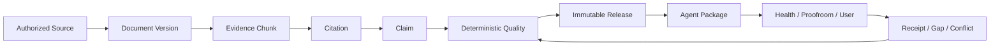

# Knowledge Foundation v2 Design

**Last reviewed:** 2026-07-25

## Context

KBase already stores normalized books, structured analysis, quality reports,
immutable Knowledge Releases, Agent Packages, delivery receipts, feedback, and
reverification tasks. The missing foundation is a single deterministic answer
to whether a claim's evidence chain is complete and whether its source can be
treated as an independent publication.

Today quality evaluation builds a flat set of allowed IDs. This catches an
unknown string but does not detect duplicate IDs, cross-book references,
citations pointing at missing chunks, or source identities that falsely appear
independent.

## Decision

Add an additive evidence-foundation layer. Do not introduce
`knowledge_release.v2` yet.



## Evidence Validator

Create `backend/app/knowledge_evidence.go` with a pure function:

```go
EvaluateKnowledgeEvidence(pkg, analysis) KnowledgeEvidenceReport
```

The report uses schema `knowledge_evidence.v1` and includes:

- canonical publication identity;
- counts and ratios;
- deterministic issues;
- per-analysis-claim evidence resolution summaries.

Issue severities:

- `blocker`: corrupt identity, cross-book edge, unresolved reference, duplicate
  conflicting ID, or explicit citation with an invalid chain;
- `warning`: legacy direct chunk reference, unknown publication identity,
  missing optional publication time, or package claims not yet linked;
- `info`: compatibility and migration information.

Stable issue codes are part of the API contract. Human-readable messages are
bounded diagnostics and are not used for program decisions.

### Identity indexes

Build indexes for chapter, chunk, package claim, citation, and analysis source
IDs. Duplicate IDs are valid only when their canonical JSON values are equal;
conflicting duplicates are blockers.

All owned objects must match `pkg.Book.BookID`. A citation's chapter and chunk
must resolve within that book. If both citation chapter and chunk chapter are
present, they must match.

### Analysis reference resolution

Resolve each `BookAnalysisClaim.CitationIDs` entry in this order:

1. explicit `BookKnowledgeCitation`;
2. chunk;
3. chapter;
4. package claim;
5. declared `BookKnowledgeChatSource`, only when its kind and ID resolve to one
   of the current package objects.

Explicit citations must terminate in a valid chunk. Direct chunk references are
accepted during Phase 1 and counted separately. Unknown or ambiguous IDs block
publication.

Coverage formulas:

```text
claim_coverage = claims_with_resolved_evidence / analysis_claims
resolution_rate = resolved_references / evidence_references
explicit_citation_coverage = claims_with_explicit_citation / analysis_claims
```

Empty denominators produce `0`, never `NaN`.

## Canonical Publication Identity

Create a bounded identity with `key`, `basis`, and
`independent_source_eligible`.

Resolution order:

1. normalized `source_type + source_account`;
2. normalized source URL hostname;
3. normalized `source_type + author` for authored book-like source types;
4. stable source key or EnID as an item fallback;
5. `book_id` fallback.

Only account, host, or explicitly eligible authored-publication identities can
count toward source independence. Item and book fallbacks remain observable but
are ineligible. Normalization lowercases, trims, collapses whitespace, and
hashes unsafe or oversized components. It never emits a local path.

## Quality Integration

`EvaluateBookAnalysisQuality` keeps existing rules and adds:

- `evidence_reference_resolution` as a hard rule;
- `evidence_chain_scope` as a hard rule;
- `explicit_citation_coverage` as a soft migration rule only after adapters are
  ready; Phase 1 records it in readiness rather than changing pass decisions;
- `source_identity` as an observability rule, not a publication blocker in
  Phase 1.

Malformed package structure is rejected. Missing evidence in otherwise valid
content is quarantined.

## Publication Defense

`PublishKnowledgeRelease` recomputes the evidence report after checking analysis
and quality hashes. Publication fails when the report has blockers or no
resolved evidence. This is independent of the stored quality decision and
protects against stale, manually edited, or forged reports.

The report is not embedded in `knowledge_release.v1`; the release already pins
content, analysis, source, citation, and quality hashes. A future release schema
can embed the normalized evidence report after migration.

## Readiness Projection

Create `backend/app/knowledge_readiness.go`. It composes:

- the existing pipeline projection;
- the evidence report;
- the latest release record.

It returns:

```json
{
  "schema_version": "knowledge_readiness.v1",
  "summary": {
    "total": 0,
    "ready": 0,
    "blocked": 0,
    "analysis_claims": 0,
    "claims_with_evidence": 0,
    "claim_coverage": 0,
    "evidence_references": 0,
    "resolved_references": 0,
    "resolution_rate": 0
  },
  "items": []
}
```

Items contain book and release IDs, title, source type, canonical publication
identity, stage, next action, counts, ratios, and bounded issue codes. They do
not contain source content or machine-specific paths.

## Failure Model

- Missing analysis: return `needs_analysis`, not an HTTP error.
- Failed analysis: return `blocked` with `analysis_failed`.
- Missing quality: return `needs_quality`.
- Corrupt package or manifest: fail the API request because the store cannot
  produce a trustworthy projection.
- Unknown publication identity: warning only.
- Unresolved evidence: quality quarantine and publication conflict.

## Testing Strategy

- Table-driven unit tests for every identity and graph invariant.
- Quality tests for quarantine/reject compatibility.
- Publication tests proving stale quality cannot bypass evidence checks.
- HTTP tests for authorization, filters, bounds, and privacy-safe payloads.
- Full Go suite, race suite for touched store paths, `go vet`, generated
  system-map check, privacy smoke, and whitespace check.

## Rollout And Rollback

Phase 1 is read-compatible and write-restrictive only for newly published
candidates with invalid evidence. Rollback removes the readiness route and the
new publication re-check; it does not require artifact migration. Existing
releases remain readable throughout rollout.
