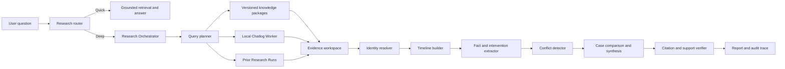

# Research Agent Platform Design

**Date:** 2026-08-13
**Status:** Approved
**Scope:** Platform-level deep research framework with a versioned public-article
collection as the first production instance

## 1. Context

The current versioned Agent runtime is effective for bounded grounded question
answering over a fixed knowledge package. It retrieves a small evidence set,
generates one answer, verifies citations, and either completes or abstains.

That execution model is not sufficient for questions that require all of the
following at once:

- searching across versioned articles and private Chatlog history;
- resolving one person across aliases, remarks, account identifiers, and group
  display names;
- reconstructing a multi-day or multi-month timeline;
- distinguishing a direct recommendation from a general discussion or a reply
  to another person;
- comparing a historical case with a current case;
- detecting changes in advice about timing, dosage, applicability, and stopping
  conditions;
- reporting what was not found instead of inventing a complete story; and
- preserving a reproducible evidence trail.

The target is not a larger one-shot prompt. The target is a research workflow
that repeatedly plans, retrieves, structures, checks gaps, and verifies its
answer.

## 2. Product decisions

The approved decisions are:

1. Build a platform capability, not a one-off feature for one Agent.
2. Ship a versioned public-article collection Agent as the first instance.
3. Support both quick answer and deep research modes.
4. Automatically route identity, history, cross-source, case-review, and
   conflict questions to deep research.
5. Allow the orchestrator to expand Chatlog scope across time ranges, groups,
   people, and comparable cases without per-query confirmation.
6. Grant the Chatlog integration complete read access while prohibiting message
   mutation, deletion, and sending.
7. Keep the complete Chatlog database on the local machine. Persist only the
   structured run, immutable locators, hashes, and the minimal quoted evidence
   required by the report.
8. Use the existing unified control plane and independent Worker pattern.
9. Continue shared Worker-token authentication. Do not introduce a request
   signature mechanism.
10. Keep the first implementation as one orchestrator with role-separated
    stages. Do not begin with a committee of autonomous Agents.

## 3. Goals

### 3.1 Functional goals

- Provide a fast path for ordinary grounded knowledge questions.
- Provide a durable Research Run for multi-step investigations.
- Query versioned knowledge packages and local Chatlog through typed read-only
  tools.
- Resolve identities conservatively and expose the binding evidence.
- Build structured timelines from messages, articles, and user-supplied facts.
- Extract interventions, symptoms, measurements, recommendations, conditions,
  dosages, and outcomes.
- Detect and explain conflicts without automatically deciding that one side is
  correct.
- Compare cases while preserving material differences.
- Verify every important claim against accessible evidence before publishing.
- Resume interrupted work from durable state.

### 3.2 Quality goals

- Never describe a missing recovery date as a confirmed recovery.
- Never call a non-monotonic numeric series monotonic.
- Never apply advice from one case to another without exposing the case
  differences.
- Never treat the final set of cited documents as the complete retrieval scope.
- Never collapse a source author's opinion into an independently verified fact.
- Never silently fall back to an ungrounded answer when a Worker or source is
  unavailable.

## 4. Non-goals

- Synchronizing the complete private Chatlog corpus to the server.
- Modifying or sending messages through Chatlog.
- Replacing domain professionals or converting private discussions into
  authoritative clinical guidance.
- Exposing hidden model chain-of-thought. The product shows an evidence-backed
  progress summary and decision record instead.
- Building a general multi-Agent committee in the first release.
- Automatically publishing private evidence into a public knowledge package.

## 5. Architecture



### 5.1 Research router

The router selects quick mode for bounded questions against an already selected
knowledge package. It selects deep mode when a request includes history,
private chat, multiple identities, multiple time periods, case reconstruction,
cross-source comparison, or conflict analysis.

The user can explicitly select either mode. When an explicit quick request
cannot be answered without research, the runtime returns a typed suggestion to
start a deep Research Run rather than silently changing the contract.

### 5.2 Research Orchestrator

The orchestrator owns a durable loop:

```text
planning
-> retrieving
-> resolving_identity
-> building_timeline
-> extracting_facts
-> detecting_conflicts
-> comparing_cases
-> synthesizing
-> verifying
-> completed | insufficient | failed | canceled
```

The verifier can send the run back to planning with a structured gap. A run can
repeat retrieval until it satisfies its evidence coverage criteria or exhausts
its explicit budget.

### 5.3 Local Chatlog Worker

The local Worker initiates outbound control-plane communication and does not
open a public inbound listener. It reads the local Chatlog service and database
without mutation privileges. The server sends typed bounded queries; the Worker
returns only the matching evidence bundle.

The Worker uses the existing shared Worker token and existing restricted update
protocol. Query authorization and Worker upgrade authorization remain separate
capabilities.

### 5.4 Evidence workspace

The evidence workspace is the boundary between retrieval and generation. Models
do not receive an unstructured dump of all returned messages. Evidence is first
normalized, deduplicated, ordered, and bound to identities and locators.

The workspace contains:

- the research questions and unresolved gaps;
- actual source and time scope;
- normalized evidence items;
- identity bindings;
- timeline events;
- extracted claims and interventions;
- conflict candidates and adjudication status;
- case comparisons;
- conclusion candidates and verification results.

## 6. Data contracts

### 6.1 Research Run

```json
{
  "run_id": "research-run-example",
  "schema_version": "research_run.v1",
  "mode": "deep",
  "question": "Compare a current case with a historical case.",
  "status": "retrieving",
  "subject_ids": ["subject-current", "subject-historical"],
  "requested_sources": ["knowledge", "chatlog"],
  "actual_scope": {
    "time_from": "2025-01-01T00:00:00Z",
    "time_to": "2026-08-13T23:59:59Z",
    "knowledge_release_ids": [],
    "chat_scope_ids": []
  },
  "step_ids": [],
  "evidence_ids": [],
  "conclusion_ids": [],
  "created_at": "2026-08-13T00:00:00Z",
  "updated_at": "2026-08-13T00:00:00Z"
}
```

Every expansion of scope is appended to the run trace with a reason. The run
distinguishes sources searched from sources cited.

### 6.2 Evidence item

```json
{
  "evidence_id": "evidence-example",
  "schema_version": "research_evidence.v1",
  "source_type": "chatlog_message",
  "source_role": "direct_advice",
  "author_identity_id": "person-author",
  "subject_identity_ids": ["person-subject"],
  "occurred_at": "2026-08-13T07:43:06+08:00",
  "content_excerpt": "A minimal quoted excerpt used by this report.",
  "locator": {
    "worker_id": "chatlog-worker",
    "conversation_ref": "opaque-conversation-ref",
    "message_ref": "opaque-message-ref"
  },
  "content_hash": "sha256:example",
  "privacy": "private"
}
```

`source_role` separates direct observation, direct advice, user history,
article opinion, external evidence, and derived analysis. A derived item cannot
serve as the sole support for another derived conclusion.

### 6.3 Identity binding

An identity can have multiple aliases, remarks, account identifiers, and group
display names. Each binding includes evidence, confidence, scope, and whether a
human confirmed it.

Identity resolution fails closed when multiple candidates remain plausible.
Name similarity alone is never sufficient. Contact metadata, group membership,
conversation continuity, self-identification, and author metadata can
contribute to a binding.

### 6.4 Timeline event

Timeline events use typed fields instead of prose-only summaries. Supported
event families include:

- symptom onset and change;
- laboratory or home measurement;
- medication or supplement start, adjustment, and stop;
- recommendation;
- reported response or adverse effect;
- exposure and lifestyle factor;
- self-reported recovery; and
- missing expected follow-up.

Numeric trends are computed by deterministic code. The model may explain a
trend but cannot decide whether a series is increasing or decreasing.

### 6.5 Claim and intervention

An extracted recommendation records the intervention, action, stage, dose,
condition, subject population, speaker, and evidence. Missing fields remain
explicitly unknown.

The system must not copy a dosage from another case into a current case merely
because the intervention name matches.

### 6.6 Conflict

Conflict candidates include:

- use versus avoid;
- different timing or infection stage;
- different dosage;
- different target population;
- later revision of an earlier opinion;
- article versus chat disagreement;
- theory versus observed case outcome; and
- a recommendation with no start or stop condition.

A conflict record carries all supporting evidence, relevant contexts, whether
the difference may be explained by applicability, and the remaining gap. The
default label is `potential_conflict`; only a verified analysis may assign a
stronger verdict.

## 7. Read-only tool protocol

The Worker and knowledge service expose typed tools to the orchestrator:

- `search_chatlog`: search by time, conversation, sender, identity, and keyword;
- `expand_chat_context`: load bounded messages before and after an anchor;
- `resolve_chat_identity`: query contact and group membership metadata;
- `list_identity_conversations`: find relevant conversations for an identity;
- `fetch_chat_message`: re-fetch one message by immutable opaque locator;
- `search_knowledge`: search versioned knowledge packages with metadata filters;
- `fetch_knowledge_evidence`: resolve a citation to its source excerpt;
- `search_prior_runs`: retrieve relevant structured prior analysis.

All tools accept explicit result limits. Responses include truncation and
continuation metadata. The orchestrator cannot mistake a truncated response for
complete history.

Tool calls are idempotent where applicable and are bound to the Research Run.
The server records request scope and result hashes without persisting unrelated
private messages.

## 8. Analysis workflow

### 8.1 Question decomposition

The planner converts a broad request into bounded research questions, such as:

- Who are the named people?
- Which messages are direct replies to the subject?
- What measurements and symptoms were reported on each date?
- What interventions began or stopped?
- Is recovery explicitly documented?
- Did the source author change advice over time?
- Which differences make the historical case non-transferable?

### 8.2 Retrieval and scope expansion

Initial retrieval uses aliases, key events, interventions, and time hints from
the request. The planner may expand time, conversations, or related cases when
the expansion resolves a named gap. Every expansion is auditable.

### 8.3 Deterministic normalization

Code performs date parsing, timezone normalization, ordering, numeric trend
calculation, exact deduplication, identity-key handling, and citation hashing.
Models perform semantic classification and summarization only after these
operations.

### 8.4 Extraction and reconstruction

An extraction model converts evidence into structured facts. The timeline
builder groups facts by subject and date. It preserves contradictions instead
of choosing one value without evidence.

### 8.5 Conflict and case comparison

The conflict detector compares interventions and recommendations across time,
source, stage, dosage, and target population. The case comparator identifies
shared features and material differences before proposing transferable lessons.

### 8.6 Synthesis and verification

The synthesis model writes from verified workspace objects. It labels direct
facts, source opinions, Agent inferences, and evidence gaps. The verifier checks
that each material statement is entailed by its citation and that privacy rules
are satisfied.

A failed verification returns a structured gap to the planner. It never
publishes an ungrounded fallback.

## 9. Model strategy

Model identity is selected through the existing model registry rather than
hard-coded into an Agent package.

- A high-reasoning model handles planning and final synthesis.
- A lower-cost structured-output model handles bulk extraction.
- A verification model checks citation entailment and unsupported conclusions.
- Deterministic code owns numeric and identity invariants.

The first release uses one orchestrator with role-separated stages. A stage may
later become an independent Agent only when evaluation data shows a material
quality or scaling benefit.

## 10. Quick and deep modes

### 10.1 Quick mode

Quick mode runs bounded hybrid retrieval, reranking, citation resolution,
generation, and verification against a selected package. It does not query
private Chatlog or autonomously broaden research scope.

### 10.2 Deep mode

Deep mode creates a durable Research Run, displays progress, uses both knowledge
and authorized private tools, and can resume after interruption. It reports
actual scope, evidence gaps, and verification status.

## 11. User experience

Agent pages provide a `Quick answer` and `Deep research` selector. Questions
that require identity, history, private evidence, or conflict analysis receive a
deep-mode recommendation.

The platform adds Research Run list and detail views. A detail view contains:

1. task summary and actual source scope;
2. understandable live progress events;
3. evidence workspace grouped by source;
4. identity binding and timeline views;
5. conflict and case-comparison views; and
6. the final report with expandable citations and gaps.

The interface exposes a progress summary, not hidden model reasoning. Unrelated
third-party identities are redacted by default.

## 12. Privacy and security

- Chatlog remains local and read-only.
- The Worker initiates outbound traffic and exposes no public local endpoint.
- The existing shared Worker token authenticates control-plane traffic.
- No request-signature mechanism is added.
- The complete private corpus is never synchronized to the server.
- Only minimal evidence excerpts used by the run are retained online.
- Opaque locators and content hashes support later re-verification.
- Evidence access follows the same authenticated browser-session boundary as
  the private Agent runtime.
- Logs exclude tokens, local paths, raw database keys, cookies, and unrelated
  message content.
- A user can remove a retained private excerpt without mutating the source
  Chatlog record; the run then records that the evidence is no longer available.

## 13. Failure semantics

The platform exposes typed failure and incomplete states:

- `worker_offline`;
- `identity_ambiguous`;
- `zero_hit`;
- `partial_evidence`;
- `budget_exhausted`;
- `citation_mismatch`;
- `source_changed`;
- `model_timeout`;
- `invalid_model_output`;
- `insufficient`;
- `failed`; and
- `canceled`.

The UI preserves completed steps and supports retry from a safe checkpoint.
Worker unavailability, truncation, or citation failure cannot silently degrade
to an ordinary ungrounded answer.

## 14. Evaluation and acceptance

The initial evaluation suite uses privacy-safe synthetic fixtures derived from
the demonstrated research patterns. It does not commit real account IDs, group
IDs, chat excerpts, or downloaded private content.

### 14.1 Historical-case reconstruction

The Agent must:

- resolve the user identity using more than name similarity;
- recover the complete ordered measurement series from the fixture;
- reconstruct symptoms, interventions, and recovery evidence;
- state when a final recovery or negative result is not present;
- avoid attributing improvement to one item in a multi-intervention bundle; and
- cite every material event.

### 14.2 Current-case analysis

The Agent must:

- calculate a non-monotonic measurement trend correctly;
- retrieve direct advice to the current subject;
- distinguish direct advice from recommendations to other people;
- detect timing and applicability changes for representative interventions;
- avoid applying a dosage from a materially different case; and
- expose the evidence gap when the source does not define a complete protocol.

### 14.3 Platform invariants

- Identity ambiguity fails closed.
- Numeric trends come from deterministic calculations.
- Critical factual and recommendation claims have re-fetchable citations.
- Search scope and citation scope are separately visible.
- Missing follow-up remains missing.
- Unsupported conclusions cannot pass verification.
- Quick-mode behavior does not regress.
- Deep runs resume safely after Worker or model interruption.

## 15. Delivery stages

### Stage A: evaluation baseline and contracts

Create synthetic gold fixtures, Research Run and evidence contracts, identity
tests, timeline tests, and citation-entailment checks.

### Stage B: local Chatlog Worker capability

Add typed contact, conversation, sender, time, context, and re-fetch operations
to the existing control-plane Worker protocol. Prove that the raw database does
not leave the local machine.

### Stage C: Research Orchestrator

Implement planning, iterative retrieval, gap-driven expansion, identity
resolution, timeline construction, intervention extraction, conflict detection,
case comparison, synthesis, and verification.

### Stage D: dual-mode product surface

Add mode selection, Research Run progress, evidence workspace, conflict view,
resumability, citations, and report export.

### Stage E: first production instance

Bind the first versioned public-article collection Agent to the research tools,
run the gold suite, deploy through the existing release gates, and repeat the
demonstrated research scenarios against the live service.

## 16. Production gates

Production release requires:

- explicit Worker-offline behavior;
- no identity misbinding in the gold suite;
- no fabricated missing dates or outcomes;
- no cross-case dosage transfer;
- re-fetchable evidence for every material conclusion;
- passing privacy checks;
- passing focused and full backend tests;
- passing frontend build and smoke checks;
- deployment health checks; and
- live deep-research verification through the production service.

Any failed gate returns the feature to the responsible upstream stage. The
system must not deploy with a known red verification result.
